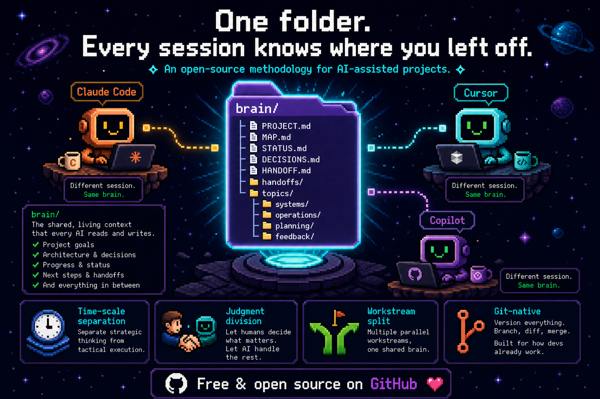

# project-brain

<p align="center">
  
</p>

> **Different session. Same brain.**
>
> A folder structure + collaboration protocol that lets your AI assistant pick up a project after a context wipe — across new sessions, new windows, new collaborators.

[中文版 →](./README.zh-CN.md)

**Part of [Sprout Labs](https://ethanflow.com)** — Local-first AI memory & agent safety, built independently by Ethan (Independent Product Designer & AI Builder, since 2016).
[ethanflow.com](https://ethanflow.com) · [LinkedIn](https://www.linkedin.com/in/ethan-ys/) · [@ethanflow_lab](https://x.com/ethanflow_lab) · [GitHub](https://github.com/Ethan-YS)

---

## The problem

Long-running projects with AI coding assistants (Claude Code, Cursor, Copilot, etc.) hit a counter-intuitive wall:

> **Larger context windows don't solve the problem. Better information structure does.**

A wider window doesn't mean it gets read. Read doesn't mean located. Located doesn't mean prioritized. Without structure, every new session starts with "wait, what's going on here?" — and the AI either reads too much (wasting tokens) or misses the critical pieces.

Symptoms you'll recognize:

- One README mixing project pitch + current status + decision history + how-to-run
- Sprawling docs where boundaries blur (one architecture file containing design + ops + history + bugs)
- Decisions buried in commit messages, chat logs, and footnotes — never traceable when you need them
- Cross-window handoff loses the "fresh stuff in your head" — the next session starts blind

`project-brain` is a structural answer: a `brain/` folder layout + a small set of protocols, designed so a fresh AI session can read 2-3 files and be productive.

## Quick start

```bash
# Clone or download
git clone https://github.com/Ethan-YS/project-brain.git

# Copy templates into your project
cp -r project-brain/templates/brain   <your-project-root>/brain
cp    project-brain/templates/CLAUDE.md  <your-project-root>/CLAUDE.md

# Fill in PROJECT.md on day one (one-line definition + what you explicitly will NOT do)
# That's it. Read METHODOLOGY.md for the rest.
```

When a new AI session opens your project:
1. The project root `CLAUDE.md` (auto-loaded by Claude Code) directs it to read `brain/MAP.md` + `brain/STATUS.md`
2. If a `brain/HANDOFF.md` exists, it picks up the previous session's "still-warm-not-yet-written-down" thoughts
3. Reports back what it understood. Then you say what to work on.

## Structure

```
brain/
├── PROJECT.md       What is this project? What do we explicitly NOT do?
├── MAP.md           Module structure + document index ("where do I find X?")
├── STATUS.md        Current state — overwritable, soft cap 80 lines
├── DECISIONS.md     Decision log — append-only, requires "rejected alternatives"
├── HANDOFF.md       Cross-window bridge — what's still in head but not yet written
├── handoffs/        Archive of past HANDOFFs (timestamped)
└── topics/          Per-problem-dimension docs
    ├── systems/      → "How is this designed?"
    ├── operations/   → "How do I operate it / what to do each release?"
    ├── planning/     → "What are we going to build / how to plan it?"
    └── feedback/     → "What is reality / users telling us?"
```

## Core principles

### 1. Time-scale separation

The five core files in `brain/` are split **by how often they change**, not by topic:

| File | Volatility | When to read |
|---|---|---|
| `PROJECT.md` | Almost never | First contact / scope ambiguous |
| `MAP.md` | Slowly | Every new session |
| `STATUS.md` | Frequently (per session) | Every new session |
| `DECISIONS.md` | Append-only, event-driven | Tracing why something is the way it is |
| `HANDOFF.md` | Per window-switch | New session start (if exists) |

Why volatility-based? Because **mixing low-frequency content with high-frequency content forces the low-frequency content to be re-edited every session** — the most common mode of doc rot.

### 2. Problem-dimension classification (not by module)

`brain/topics/` is divided into 4 dimensions: `systems` / `operations` / `planning` / `feedback`. A single business module (say, "payment") has its design in `systems/`, deploy logs in `operations/`, pricing strategy in `planning/`, user feedback in `feedback/`.

Why? Modules grow, shrink, get renamed, get merged. The four problem dimensions are far more stable.

### 3. Decision logging requires "rejected alternatives"

Every entry in `DECISIONS.md` must include what was considered and rejected, and why. Without this, the file degrades into a worse version of `CHANGELOG.md` (which already records "what was done"). The unique value of decision logs is **the paths not taken** — that's where a project's judgment lives.

### 4. Judgment Division

When the user says "update the project brain":
- **The user** decides "should we record now" (high-level pacing instinct)
- **The AI** decides "specifically what to record / how to write each entry" (specialized understanding of how each file works)
- **The user** approves or rejects the AI's judgment

The AI should not push specialized judgments back ("which files do you want me to update?") — that hands the wrong layer of judgment to the wrong person.

### 5. Workstream split mode (v2.1, optional)

Some projects naturally have parallel independent workstreams (e.g., development + operations + outreach in one product). For these, `STATUS` and `HANDOFF` split per workstream:

```
brain/
├── PROJECT.md           ← shared
├── MAP.md               ← shared
├── DECISIONS.md         ← shared
├── STATUS_dev.md        ← split per workstream
├── STATUS_ops.md
├── HANDOFF_dev.md
├── HANDOFF_ops.md
├── handoffs/
│   ├── dev/
│   └── ops/
└── topics/              ← shared
```

Single-workstream projects ignore this — they keep the default `STATUS.md` / `HANDOFF.md`.

## Why this exists — the evolution story

This methodology didn't appear from a design session. It evolved through real use across multiple projects — each iteration triggered by friction we hit and couldn't ignore.

**v1 (April 2026)**: After accumulating 15+ scattered docs and one 32KB monolithic file in a single project, every new AI session needed to re-read everything to figure out "what's going on here?" We refactored across 4 commits and established the basic structure: `meta/` (continuity layer) + `docs/` (problem-dimension classified). The core insight was **separating files by volatility** — stable / slowly-changing / per-session / append-only — to prevent the most common doc-rot pattern: low-frequency content getting re-edited because it lives next to high-frequency content.

**v2 (April 30, 2026)**: We surveyed community approaches (Prompt Shelf 2026's three-file architecture, softaworks/agent-toolkit's session-handoff skill, Anthropic's official skills repo). We found:
- Community solutions were stronger at **runtime mechanics** (auto-handoff triggers, staleness detection, handoff chains)
- Our v1 was structurally deeper in three places: the "what we explicitly DON'T do" forcing function in PROJECT.md, mandatory "rejected alternatives" in decision log, and classification by problem-dimension instead of by module

The plan was "borrow the runtime layer, keep the structural layer." But across 8 rounds of refinement, **the user systematically rejected mechanism creep**. Every time the AI proposed "let me design auto-detection / triggering / staleness checking," the user said "no — that's a judgment I'll make myself."

This crystallized into the **Judgment Division Principle** (see Core principle 4): the user decides "should we record now"; the AI decides "what specifically to record"; the user reviews. Don't hide specialized judgment behind automation.

Companion design changes: merged `meta/` + `docs/` into a single `brain/`, added `HANDOFF.md` for cross-window continuity, replaced "hard keyword detection" with **gentle inquiry** ("does this count as decided?" instead of asserting "we decided X"), made placeholders visually loud (`⚠️ TODO ⚠️`), and made the git prerequisite explicit.

**v2.1 (same day, evening)**: A second project — non-development, running parallel workstreams (official ops + outreach) — broke v2's hidden assumption that "one project = one workstream." The user had naturally evolved a workaround using `STATUS_<workstream>.md` naming. We folded it into the methodology as **Workstream Split Mode** (Core principle 5): project-level files stay shared, status and handoff split per workstream.

### The meta-takeaway

The healthy evolution pattern wasn't "design everything upfront." It was **"build what works now, let real-world friction drive the next version."** Each version came from a specific, named problem. Each refinement was triggered by a real moment of pain.

If you take one thing from this repo: **resist the urge to design comprehensive automation up front**. Real friction tells you which mechanisms are worth building, and which would just hand specialized judgment to the wrong layer.

## Documentation

- **[METHODOLOGY.md](./METHODOLOGY.md)** — full methodology including all 14 traps, judgment division mechanics, workstream split details, and migration paths
- **[CHANGELOG.md](./CHANGELOG.md)** — version history
- **[templates/](./templates/)** — drop-in templates for `brain/` + project-root `CLAUDE.md`

## Compatibility

This methodology is AI-agnostic. It works with:
- **Claude Code** (the project-root `CLAUDE.md` template uses Claude Code's auto-load behavior)
- **Cursor** (`.cursorrules` can point to `brain/MAP.md` + `brain/STATUS.md`)
- **GitHub Copilot Chat** (instruction file pointing to brain/ files)
- Any other AI assistant that respects a project-level instruction file

What it requires:
- **Git** — several mechanisms (HANDOFF archival, decision traceability, file blame) assume git history
- That's it.

## Status

🌱 v2.1 — methodology stable, two projects running n=1 and n=2 in production. Not yet widely used; treat as "battle-tested by two power users, validating in the wild."

## Authors

Co-developed by **Rebecca** (independent developer, project lead) and **Sage** (her AI thinking partner). Eight rounds of iteration in a single working day, each triggered by a specific friction point — not a design session.

The methodology itself models how we work: clear judgment division, refusal to automate away decisions that should be made by humans, and willingness to admit when v1 needs to become v2.

## License

[MIT](./LICENSE) — use it, modify it, share it. If it helps your workflow, a star on the repo is appreciated.

## Contributing

Issues and PRs welcome. The methodology is intentionally minimalist — proposals to add mechanisms should clearly identify the specific friction they solve. New traps (mistakes you've hit using this) are especially welcome.
